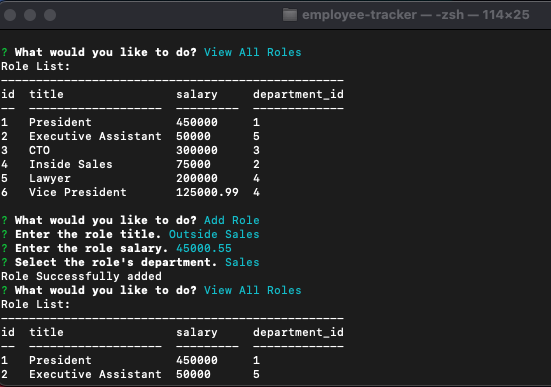

# Employee Tracker
  

  ## Description

  This application is a solution for managing an organization's employees using Node.js, the inquirer package, and MySQL. 

  Users are able to view employees, roles, and departments within the organization. Users can add to each of these as well as update employee roles as needed.

  [GitHub Repository](https://github.com/cikennedy/employee-tracker)

  [Video Walkthrough](https://youtu.be/mtbrIQzbU_w)

  ## Table of Contents

  * [Installation](#installation)

  * [Usage](#usage)
  
  * [License](#license)

  * [Badges](#badges)

  * [Questions](#questions)

  ## Installation

  For this project to run properly, install the necessary dependencies by using the following terminal command: npm i

  The user will also need to have MySQL installed on their machine with a working connection in order for this application to function locally. 

  ## Usage

  To start this application, use the following command from the command line in the root directory: npm start

  This will initialize the application and the inquirer prompts will follow. 

  

  ## License

  This project is licensed using the MIT license.

  ## Badges

  

  ## Questions

  If you have any questions or feedback about the project, please contact me by email at [kennedy.christopherian@gmail.com](mailto:kennedy.christopherian@gmail.com). 

  Other projects and work are featured at [cikennedy](https://github.com/cikennedy).

